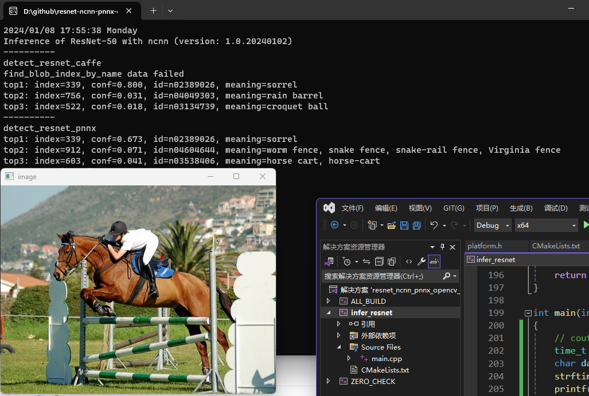
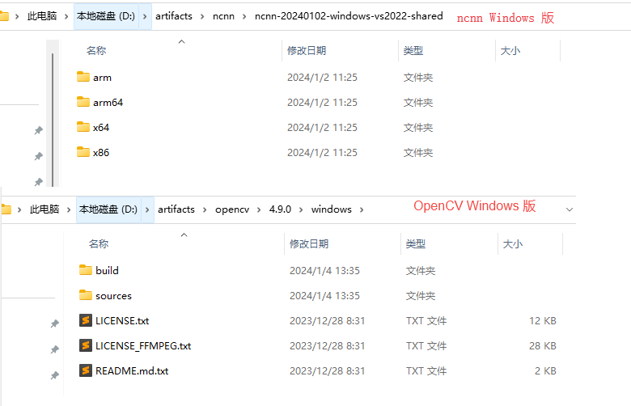

# resnet-ncnn-pnnx-opencv-cpp

## 简介

使用 pnnx 工具， 转换 resnet 的 PyTorch 模型到 ncnn 格式。然后用 opencv 读取图像和imshow， 用 ncnn 做推理， 执行图像分类，输出类别和置信度。

你可以基于这个工程， 直接(或者很少修改)放到 Android JNI / 车载开发板上部署。



## 安装 - Python 相关

安装 Python, 例如通过 miniconda 安装。

安装 torch, pnnx 等 python 包:

```bash
pip install numpy matplotlib
pip install -U torch torchvision
pip install -U pnnx
```

## 安装 - C++ 相关



下载 ncnn: https://github.com/Tencent/ncnn/releases

我用的动态库, 解压到 `D:\artifacts\ncnn\ncnn-20240102-windows-vs2022-shared` 目录

下载 opencv: https://github.com/opencv/opencv/releases/

解压到 `D:\artifacts\opencv\4.9.0\windows` 目录

## 转模型

```powershell
python convertmodel.py
```

得到很多文件，我们只用到 `resnet50.ncnn.param` 和 `resnet50.ncnn.bin`.

## C++ 推理

- `detect_resnet_pnnx()`: PyTorch 官方仓库中 resnet50 的推理
- `detect_resnet_caffe()`: Kaiming He 原版 resnet, 使用 convertmodel.com 转换为 ncnn 模型（不带 ncnnoptimize，不带 fp16）。模型太大，不上传了，可从百度网盘下载（https://pan.baidu.com/s/1muvGkTr8X9fdC2Ke_9NiCQ?pwd=3w6r pswd: 3w6r）并从 convertmodel.com 转换

两个模型的输入、输出处理差异，见 `detect_resnet_pnnx()` 函数:
```cpp
// There are 6 differences between PyTorch resnet50 and caffe resnet50
static int detect_resnet_pnnx(const cv::Mat& bgr, std::vector<float>& cls_scores)
{
    printf("%s\n", __FUNCTION__);
    ncnn::Net net;
    net.opt.use_vulkan_compute = false;

    // difference 1: model file name contains "ncnn"
    // torchvision.models.resnet50
    if (net.load_param("resnet50.ncnn.param"))
        exit(-1);
    if (net.load_model("resnet50.ncnn.bin"))
        exit(-1);

    // difference 2: network requires RGB, not BGR. i.e. PIXEL_BGR2RGB instead of PIXEL_BGR
    const int target_width = 224;
    const int target_height = 224;
    ncnn::Mat in = ncnn::Mat::from_pixels_resize(bgr.data, ncnn::Mat::PIXEL_BGR2RGB, bgr.cols, bgr.rows, target_width, target_height);

    // difference 3: mean values instead of std values
    const float mean_vals[3] = { 0.485f * 255, 0.456f * 255, 0.406f * 255 };
    const float norm_vals[3] = { 1 / (0.229f * 255), 1 / (0.224f * 255), 1 / (0.225f * 255) };
    in.substract_mean_normalize(mean_vals, norm_vals);


    ncnn::Extractor ex = net.create_extractor();

    // difference 4: input blob name is in0, not data
    ex.input("in0", in);
    //ex.input("data", in);

    ncnn::Mat out;
    // difference 5: output blob name is out0, not prob
    ex.extract("out0", out);
    //ex.extract("prob", out);

    // difference 6: manually call softmax on the fc output.
    // convert result into probability
    // skip if your model already has softmax operation
    if(1)
    {
        ncnn::Layer* softmax = ncnn::create_layer("Softmax");

        ncnn::ParamDict pd;
        softmax->load_param(pd);

        softmax->forward_inplace(out, net.opt);

        delete softmax;
    }

    cls_scores.resize(out.w);
    for (int j = 0; j < out.w; j++)
    {
        cls_scores[j] = out[j];
    }

    return 0;
}
```

## Debug

VS 调试当前 C++ 工程，如果 ncnn 和 opencv 都使用了动态库， 可以在 Debug 模式调试自己的代码。

如果使用了 ncnn 静态库（zip名字不带 shared），需要自行编译安装 ncnn 的 VS Debug 版本。

## Referenecs

- https://github.com/Tencent/ncnn
- https://github.com/opencv/opencv

